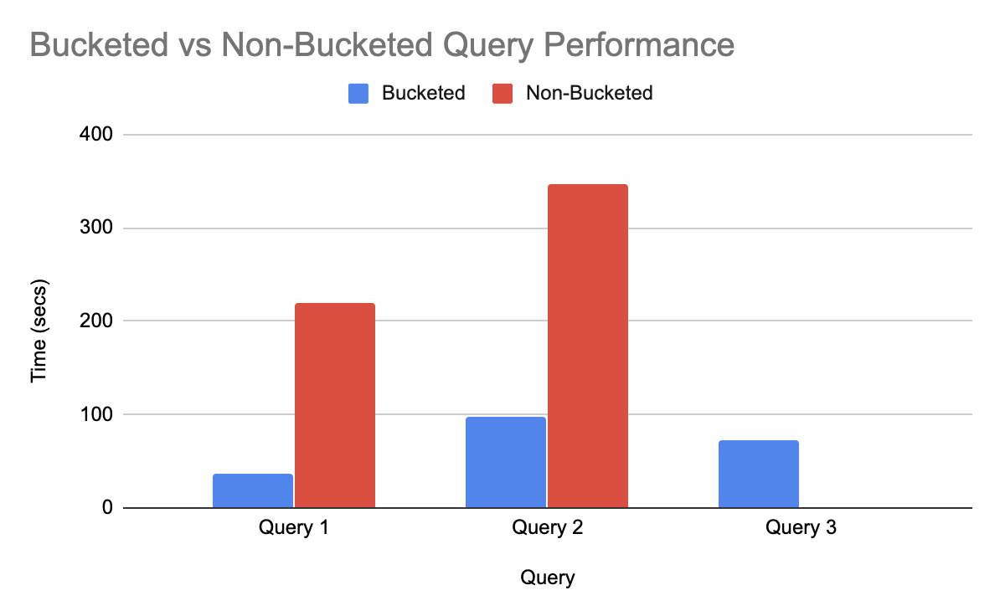

# Okera performance benchmarking for Apache Hive bucketing datasets

This test is based on a standard [TPC-DS](http://www.tpc.org/tpcds/) dataset and includes the following tables.
* catalog_sales
* store_sales
* store_returns
* item
* date_dim
* store

There are several ways to generate data for TPC-DS, which are not covered in this blog.

## Test infrastructure

### Okera cluster setup
1 planner, 3 workers - m5.4xlarge

### Client used
Databricks spark: 1 driver, 3 executors - m5.4xlarge

### Record count and size
Files are stored in parquet format

| Dataset Name |  Record Count | Record Size |
| :------------------ | :---------- | :---------- |
| catalog_sales      | 1439980416 | 164 GB |
| store_sales      | 2879987999 | 220 GB |
| store_returns      | 287999764 | 25 GB |

Other helpers tables like date_dim, store, and item are smaller tables.

## Test setup
* Test tables' create statements can be found in the `test-tables` folder. For simplicity's sake, the same underlying data is used for both non-bucketed and bucketed queries. For bucketed tables we would specify the `CLUSTERED BY` clause that indicates a bucketed table. For non-bucketed tables we would not specify that clause. This results in different query execution plans, and we will use it for bucketed vs non-bucketed query performance.
* The test tables for bucketed tables are bucketed (clustered) by the `xx_customer_sk` which is common in the three tables used for comparison. Note: in order for the join to be evaluated as a `bucketed hash join`, the bucketing column type has to match between the tables involved in the join. The column names do not need to match.
* For non-bucketed tables, we do not specify the `CLUSTERED BY` clause, thus making it look like a regular table without any bucketed info (although it still refers to the same bucketed dataset stored in the test storage).


## Test run details.
* First we create the test tables and views in Okera by running the DDL statements in the `test-tables` folder.
* Here we seed bucketed and non-bucketed tables. In addition, we also seed views that represent the join queries. This is necessary in order to evaluate the entire join query in Okera instead of the client (Databricks in this case). More about Okera views [here](https://docs.okera.com/odas/latest/integrate/hive-best-practices/#external-views)
* The queries specified in the `queries` folder are then run from a databricks cluster that is connected to Okera. More about Databricks<->Okera integration [here](https://docs.okera.com/odas/latest/integrate/databricks-integration/)
* When a query is executed from a Databricks notebook cell, the query is first sent to the Okera planner for auditing purposes (access control), which will return a detailed plan for the query. Each plan node is then treated as individual table scan on Databricks' side. The scan tasks are sent to Okera workers, which in turn scan the records from the underlying storage and send the results back to the client where other join aggregation operations take place. In order to ensure the `bucketed hash join` happens in Okera, we created the views in Okera, in which case the view is executed in Okera and the client, Databricks, treats it as any other table.

## Test Queries
* Benchmark queries can be found under `queries` folder. Note: the below one is for bucketed tables; similar queries were run for the non-bucketed case that just replaced the bucketed with non-bucketed tables/views.
```
-- Query 1: Join between catalog_sales and store_returns. Simulates big-medium tables
SELECT
 i_item_id,
 i_item_desc,
 s_state,
 count(sr_return_quantity) as store_return_quantitycount,
 count(cs_quantity) as catalog_sales_quantitycount
FROM bb.cs__sr__bucketed__view
JOIN bb.store ON (s_store_sk = sr_store_sk )
JOIN bb.item ON (i_item_sk = sr_item_sk)
group by i_item_id, i_item_desc, s_state
order by i_item_id, i_item_desc, s_state;

-- Query 2: Join of two big-medium table joins. One between catalog_sales and store_returns,
-- another between store_sales and store_returns.
select i_item_id
       ,i_item_desc
       ,s_state
       ,count(ss_sr.ss_quantity) as store_sales_quantitycount
       ,avg(ss_sr.ss_quantity) as store_sales_quantityave
       ,stddev_samp(ss_sr.ss_quantity) as store_sales_quantitystdev
       ,stddev_samp(ss_sr.ss_quantity)/avg(ss_sr.ss_quantity) as store_sales_quantitycov
       ,count(cs_sr.sr_return_quantity) as_store_returns_quantitycount
       ,avg(cs_sr.sr_return_quantity) as_store_returns_quantityave
       ,stddev_samp(cs_sr.sr_return_quantity) as_store_returns_quantitystdev
       ,stddev_samp(cs_sr.sr_return_quantity)/avg(cs_sr.sr_return_quantity) as store_returns_quantitycov
       ,count(cs_sr.cs_quantity) as catalog_sales_quantitycount
       ,avg(cs_sr.cs_quantity) as catalog_sales_quantityave
       ,stddev_samp(cs_sr.cs_quantity)/avg(cs_sr.cs_quantity) as catalog_sales_quantitystdev
       ,stddev_samp(cs_sr.cs_quantity)/avg(cs_sr.cs_quantity) as catalog_sales_quantitycov
 from bb.cs__sr__bucketed__view cs_sr,
  bb.ss__sr__bucketed__view ss_sr,
  bb.date_dim d1,
  bb.date_dim d2,
  bb.date_dim d3,
  bb.store,
  bb.item
 where d1.d_quarter_name = '2001Q1'
   and d1.d_date_sk = ss_sr.ss_sold_date_sk
   and i_item_sk = ss_sr.ss_item_sk
   and s_store_sk = ss_sr.ss_store_sk
   and ss_sr.ss_customer_sk = cs_sr.sr_customer_sk
   and ss_sr.ss_item_sk = cs_sr.sr_item_sk
   and ss_sr.ss_ticket_number = cs_sr.sr_ticket_number
   and cs_sr.sr_returned_date_sk = d2.d_date_sk
   and d2.d_quarter_name in ('2001Q1','2001Q2','2001Q3')
   and cs_sr.cs_sold_date_sk = d3.d_date_sk
   and d3.d_quarter_name in ('2001Q1','2001Q2','2001Q3')
 group by i_item_id, i_item_desc, s_state
 order by i_item_id, i_item_desc, s_state
 limit 100;

-- Query 3: Join between 2 big tables. store_sales joined with catalog_sales.
select i_item_id
       ,i_item_desc
       ,s_state
       ,count(ss_quantity) as store_sales_quantitycount,
       count(cs_quantity) as catalog_sales_quantitycount
FROM bb.ss__cs__bucketed__view
JOIN bb.store ON (s_store_sk = ss_store_sk )
JOIN bb.item ON (i_item_sk = ss_item_sk)
group by i_item_id, i_item_desc, s_state
order by i_item_id, i_item_desc, s_state;
```

## Test results and observations
* With the above test run details and understanding, here are the metrics for running the three different benchmark queries.

| Query |  Bucketed (secs)  | Non-Bucketed (secs) |
| :------------------ | :---------- | :---------- |
| Query 1      | 35.96 | 219.6 |
| Query 2      | 97.2 | 346.8 |
| Query 3      | 72.6 | Out-of-memory error |

The third query resulted in an Out-of-memory error for non-bucketed joins between two big tables (store_sales and catalog_sales).


